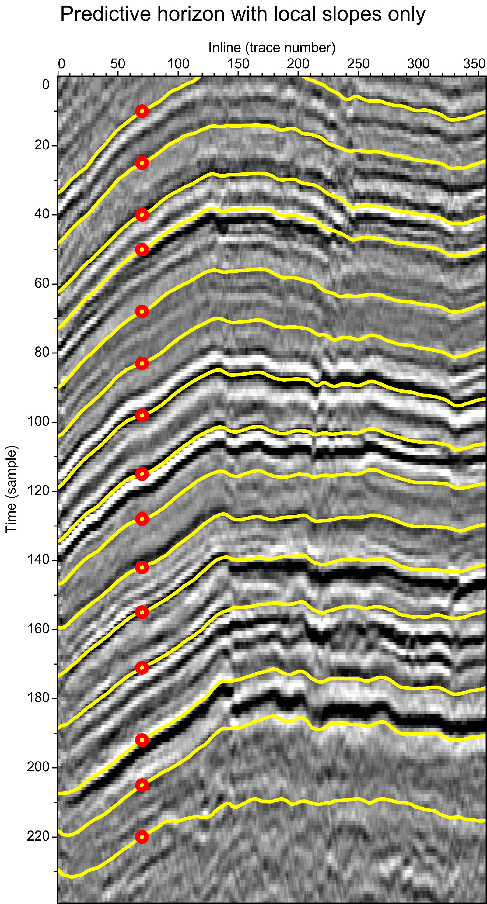
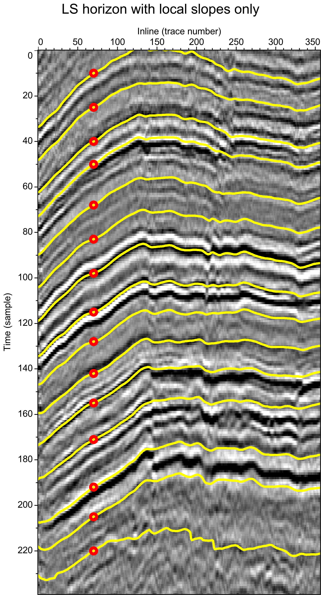
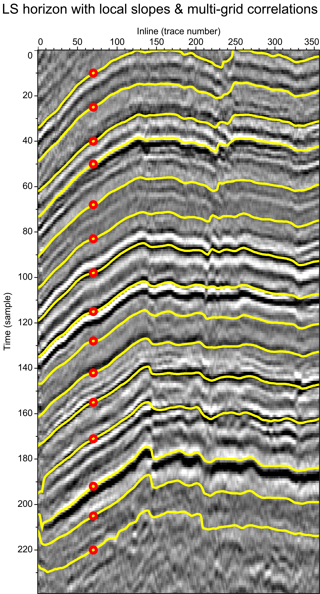
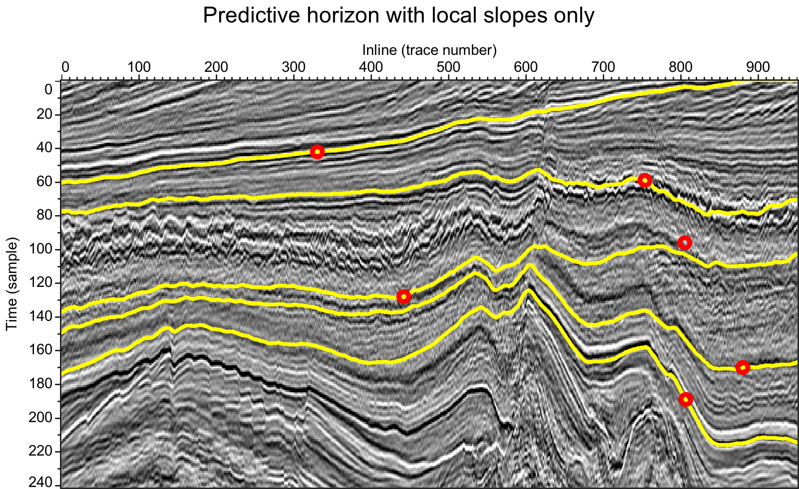
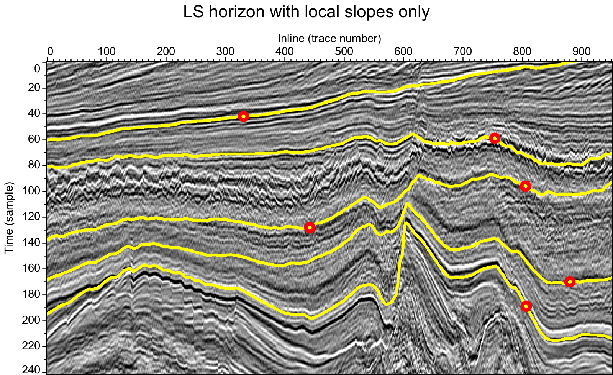
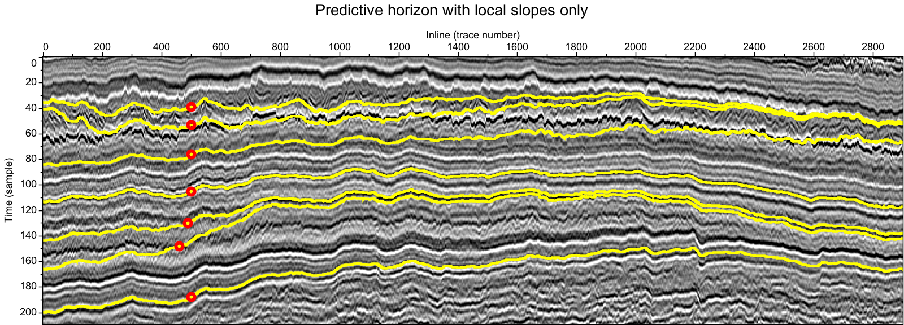
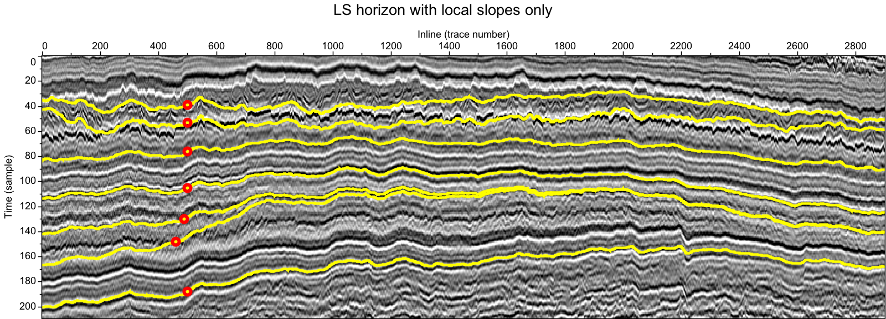
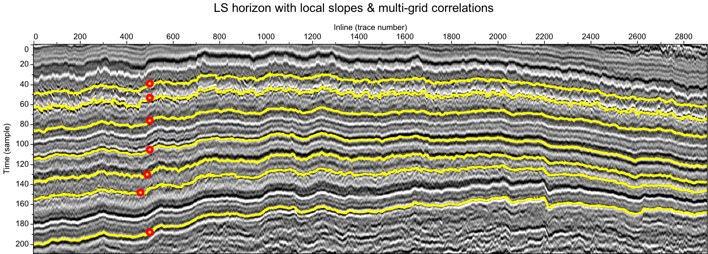
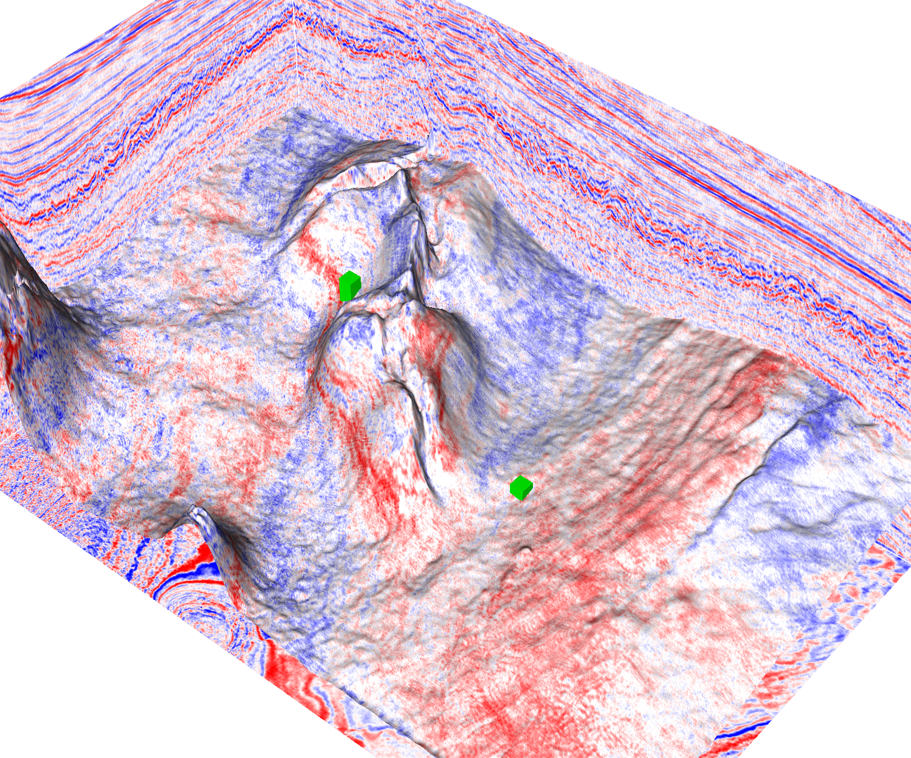

## Least-squares horizons with local slopes and multi-grid correlations

This repository contains computer programs written and used by 
[Xinming Wu](http://www.jsg.utexas.edu/wu/) 
for 2D and 3D horizon extraction that is discussed in our Geophysics paper 
[Least-squares horizons with local slopes and multi-grid correlations](http://www.jsg.utexas.edu/wu/files/wu2018LeastSquaresHorizons.pdf).

If you find this work helpful in your research, please cite:

    @article{wu2018least,
        author = {Xinming Wu and Sergey Fomel},
        title = {Least-squares horizons with local slopes and multi-grid correlations},
        journal = {GEOPHYSICS},
        volume = {83},
        issue = {4},
        pages = {IM29-IM40},
        year = {2018},
        doi = {10.1190/geo2017-0830.1},
        URL = {https://doi.org/10.1190/geo2017-0830.1},
    }

### Requirements

#### 1) Installing the Java Development Kit (JDK)
Before building the package, you must first install Java SE JDK 7 (or 8). This package has been tested on OSX and Linux. 

On Windows, we like to put tools such as the JDK in a folder named C:\pro\. This folder name is shorter than "C:\Program Files" and contains no spaces, which makes it easy to specify in scripts and environment variables.

#### 2) Building the package
Please install [Gradle](https://gradle.org/install/) to automaticcally build the package.

#### 3) [Mines Java Toolkit](https://github.com/dhale)
This package dependes on the JTK (Mines Java Toolkit) 
by [Dr. Dave Hale](http://inside.mines.edu/~dhale/). However, this package 
can be built without the needing of installing JTK becuase the 
edu-mines-jtk-1.0.0.jar has been already included in the ./libs

---
### Summary

Here are brief descriptions of key components:

#### HorizonExtractor2
Implements 3 methods for extracting 2D horizon curves:
1) predictive horizons with local slopes only;
2) least-squares horizons with local slopes only;
3) least-squares horizons with both local slopes and multi-grid correlations.

#### HorizonExtractor3
Implements 2 methods for extracting 3D horizon surfaces:
1) least-squares horizons with local slopes only;
2) least-squares horizons with both local slopes and multi-grid correlations.

#### demo2
type ./jy demo2 
to run the three 2D horizon extraction methods 
in 3 different examples 

#### demo3
type ./jy demo3 
to run the two 3D horizon extraction methods 
in 2 examples 

please email me xinming.wu@beg.utexas.edu to ask for the 3D datasets

---
## Examples

2D and 3D examples published in the [paper](http://www.jsg.utexas.edu/wu/files/wu2018LeastSquaresHorizons.pdf).
### 2D examples

#### 1) Teapot Dome (seismic data provided by the Rocky Mountain Oilfield Testing Center)
Left: predictive horizons with only local slopes

Center: least-squares horizons with only local slopes

Right: least-squares horizons with both local slopes and multi-grid correlations (proposed)

  
  
  

#### 2) Netherlands off-shore F3 (seismic data provided by the Dutch Government through TNO and dGB Earth Sciences)
Left: predictive horizons with only local slopes

Center: least-squares horizons with only local slopes

Right: least-squares horizons with both local slopes and multi-grid correlations (proposed)

  
  
  

#### 3) Curt (seismic data provided by Australian government)
Top row: predictive horizons with only local slopes

Middle row: least-squares horizons with only local slopes

Bottom row: least-squares horizons with both local slopes and multi-grid correlations (proposed)

  

  

  

### 3D examples

#### 1) Netherlands off-shore F3 (seismic data provided by the Dutch Government through TNO and dGB Earth Sciences)
Top row: least-squares horizons with only local slopes

Bottom row: least-squares horizons with both local slopes and multi-grid correlations (proposed)

  
  

  
  

#### 2) Seismic data provided by RCRL at BEG (purchased from Australian Government-Geoscience Australia)
A horizon surface extracted using the proposed method with one control point (green point in (b))

  

---
Copyright (c) 2018, Xinming Wu. All rights reserved.
This software and accompanying materials are made available under the terms of
the [Common Public License - v1.0](http://www.eclipse.org/legal/cpl-v10.html),
which accompanies this distribution.
